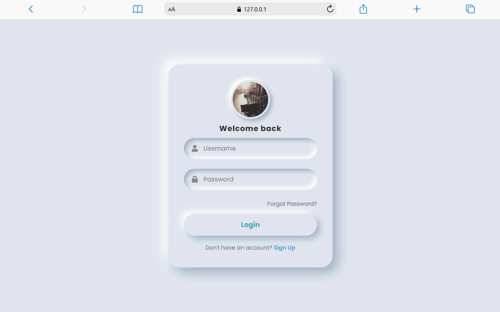

 # Neumorphism Login Form
 
 A clean, responsive login form styled with a soft neumorphism aesthetic. Built with plain HTML and CSS.
 
 ## Preview
 

 
 ## Features
 
 - Neumorphic card with soft shadows and rounded corners
 - Profile image with hover effect
 - Username and password inputs with icons
 - Focus states and subtle transitions
 - Responsive layout with device-targeted media queries
 
 ## Tech Stack
 
 - HTML5
 - CSS3 (custom shadows, border-radius, responsive media queries)
 - Google Fonts: Poppins
 - Font Awesome (for input icons)
 
 ## Getting Started
 
 - Open `index.html` directly in your browser.
 - No build tools or dependencies required.
 
 ## File Structure
 
 - `index.html` — markup for the login UI  
 - `styles.css` — neumorphic styling and responsive rules
 
 ## Responsive Notes
 
 - Base styles target desktop and scale down gracefully.
 - Includes mobile adjustments and device-specific breakpoints (e.g., Samsung Tab S7).
 
 ## License
 
 MIT © YouTube Demo
